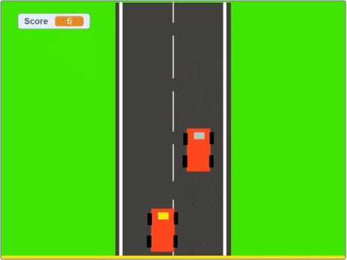

# :car: Dodge Car Game

A simple dodge and crash car game created in [MIT SCRATCH](https://scratch.mit.edu/)
>Created this Scratch for PSet 0, CS50x 2020

:video_game: Play this game in [Scratch](https://scratch.mit.edu/projects/391694117/)

## Instructions
Use Left/Right arrow keys to move, avoid traffic and stay on road.

| Keys                         | Action              |
| ---------------------------- | ------------------- |
| <kbd>←</kbd> or <kbd>→</kbd> | Steer Left or Right |
| <kbd>A</kbd> or <kbd>D</kbd> | Move Left or Right  |
| <kbd>H</kbd>                 | Honk                |
| <kbd>R</kbd>                 | Restart Game        |

